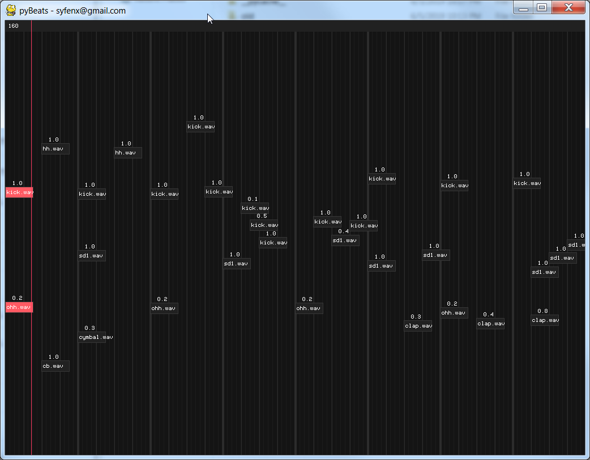

# Pybeats

>###### Python Beat Sequencer




Video:

[](http://www.youtube.com/watch?v=sadCfCpB_iM)

## Installation

Requires Python 3.4+ (tested with python 3.7), pygame, pybass

If running on Linux, you will need to install 'libbass.so'

```sh
pip install -r requirements.txt
```

## Usage example

Shortcuts:
- numbers 1 - 0 (not numpad) are basic sounds / samples, right click to add, left click to delete.
- mousewheel over note controls volume / velocity


## Development setup

Install the requirements as listed above and run the file directly.

```sh
python main.py
```

## Release History

* 0.0.1
    * First release, work in progress

## Meta

Sam H. – [@shuff_co](https://twitter.com/shuff_co) – syfenx@gmail.com

[https://github.com/syfenx/](https://github.com/syfenx/)

## Contributing

1. Fork it (<https://github.com/syfenx/pyBeats/fork>)
2. Create your feature branch (`git checkout -b feature/fooBar`)
3. Commit your changes (`git commit -am 'Add some fooBar'`)
4. Push to the branch (`git push origin feature/fooBar`)
5. Create a new Pull Request